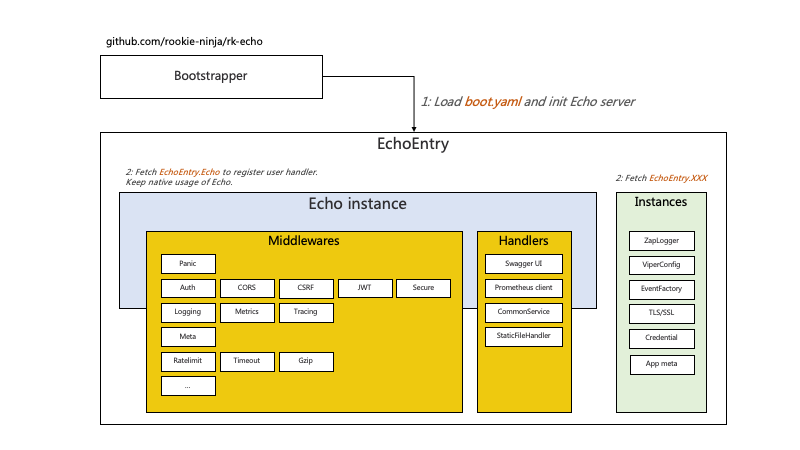
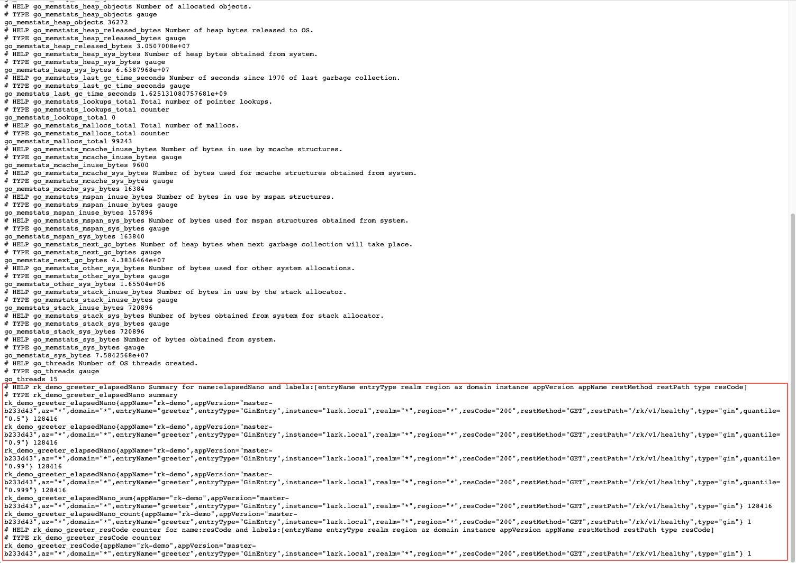

<h2 align="center">
  rk-echo
</h2>
<p align="center">
  Inject middlewares & server configuration of <a href="https://github.com/labstack/echo">labstack/echo</a> from YAML file.
</p>
<p align="center">
  This belongs to <a href="https://github.com/rookie-ninja/rk-boot">rk-boot</a> family. We suggest use this lib with <a href="https://github.com/rookie-ninja/rk-boot">rk-boot</a>.
</p>

<p align="center">
 <a href="https://github.com/rookie-ninja/rk-echo/actions/workflows/ci.yml"></a>
 <a href="https://codecov.io/gh/rookie-ninja/rk-echo"></a>
 <a href="https://goreportcard.com/badge/github.com/rookie-ninja/rk-echo"></a>
 <a href="https://sourcegraph.com/github.com/rookie-ninja/rk-echo?badge"></a>
 <a href="https://godoc.org/github.com/rookie-ninja/rk-echo"></a>
 <a href="https://github.com/rookie-ninja/rk-echo/releases"></a>
 <a href="https://opensource.org/licenses/Apache-2.0"></a>
<p>

<div id="badges" align="center">
  <a href="https://rkdev.info">
    
  </a>
  <a href="https://rk-syz1767.slack.com/rk-boot">
    
  </a>
</div>

## Architecture


## Quick Start
In the bellow example, we will start microservice with bellow functionality and middlewares enabled via YAML.

- [labstack/echo](https://github.com/labstack/echo) server
- Swagger UI
- Docs
- CommonService
- Prometheus Metrics (middleware)
- Logging (middleware)
- Meta (middleware)

Please refer example at [example/boot/simple](example/boot/simple).

### Installation
```shell
go get github.com/rookie-ninja/rk-echo
```

### 1.Create boot.yaml
- [boot.yaml](example/boot/simple/boot.yaml)

<details>
<summary>show</summary>

```yaml
---
echo:
  - name: greeter                     # Required
    port: 8080                        # Required
    enabled: true                     # Required
    commonService:                    # Optional
      enabled: true                   # Optional, default: false
    sw:                               # Optional
      enabled: true                   # Optional, default: false
    docs:                             # Optional
      enabled: true                   # Optional, default: false
    prom:
      enabled: true                   # Optional, default: false
    middleware:
      logging:
        enabled: true
      prom:
        enabled: true
      meta:
        enabled: true
```

</details>

### 2.Create main.go
- [main.go](example/boot/simple/main.go)

<details>
<summary>show</summary>

```go
// Copyright (c) 2021 rookie-ninja
//
// Use of this source code is governed by an Apache-style
// license that can be found in the LICENSE file.
package main

import (
	"context"
	"embed"
	_ "embed"
	"fmt"
	"github.com/labstack/echo/v4"
	"github.com/rookie-ninja/rk-echo/boot"
	"github.com/rookie-ninja/rk-entry/v2/entry"
	"net/http"
)

// How to use embed.FS for:
//
// - boot.yaml
// - rkentry.DocsEntryType
// - rkentry.SWEntryType
// - rkentry.StaticFileHandlerEntryType
// - rkentry.CertEntry
//
// If we use embed.FS, then we only need one single binary file while packing.
// We suggest use embed.FS to pack swagger local file since rk-entry would use os.Getwd() to look for files
// if relative path was provided.
//
//go:embed docs
var docsFS embed.FS

func init() {
	rkentry.GlobalAppCtx.AddEmbedFS(rkentry.SWEntryType, "greeter", &docsFS)
}

//go:embed boot.yaml
var boot []byte

// @title RK Swagger for Echo
// @version 1.0
// @description This is a greeter service with rk-boot.
func main() {
	// Bootstrap preload entries
	rkentry.BootstrapPreloadEntryYAML(boot)

	// Bootstrap echo entry from boot config
	res := rkecho.RegisterEchoEntryYAML(boot)

	// Get EchoEntry
	echoEntry := res["greeter"].(*rkecho.EchoEntry)
	// Use *echo.Echo adding handler.
	echoEntry.Echo.GET("/v1/greeter", Greeter)

	// Bootstrap echo entry
	echoEntry.Bootstrap(context.Background())

	// Wait for shutdown signal
	rkentry.GlobalAppCtx.WaitForShutdownSig()

	// Interrupt echo entry
	echoEntry.Interrupt(context.Background())
}

// Greeter handler
// @Summary Greeter service
// @Id 1
// @version 1.0
// @produce application/json
// @Param name query string true "Input name"
// @Success 200 {object} GreeterResponse
// @Router /v1/greeter [get]
func Greeter(ctx echo.Context) error {
	return ctx.JSON(http.StatusOK, &GreeterResponse{
		Message: fmt.Sprintf("Hello %s!", ctx.QueryParam("name")),
	})
}

type GreeterResponse struct {
	Message string
}
```

</details>

### 3.Start server

```go
$ go run main.go
```

### 4.Validation

<details>
<summary>show</summary>

#### 4.1 Echo server
Try to test Echo Service with [curl](https://curl.se/)

```shell script
# Curl to common service
$ curl localhost:8080/rk/v1/ready
{
  "ready": true
}

$ curl localhost:8080/rk/v1/alive
{
  "alive": true
}
```

#### 4.2 Swagger UI
Please refer **sw** section at [Full YAML](#full-yaml).

By default, we could access swagger UI at [http://localhost:8080/sw](http://localhost:8080/sw)


#### 4.3 Docs UI
Please refer **docs** section at [Full YAML](#full-yaml).

By default, we could access docs UI at [http://localhost:8080/docs](http://localhost:8080/docs)


#### 4.4 Prometheus Metrics
Please refer **middleware.prom** section at [Full YAML](#full-yaml).

By default, we could access prometheus client at [http://localhost:8080/metrics](http://localhost:8080/metrics)
- http://localhost:8080/metrics


#### 4.5 Logging
Please refer **middleware.logging** section at [Full YAML](#full-yaml).

By default, we enable zap logger and event logger with encoding type of [console]. Encoding type of [json] is also supported.

```shell script
2021-12-27T22:18:31.466+0800    INFO    boot/echo_entry.go:1106 Bootstrap echoEntry     {"eventId": "f01c3418-d48f-432f-9391-ad6a7567d0f8", "entryName": "greeter"}
------------------------------------------------------------------------
endTime=2021-12-27T22:18:31.468366+08:00
startTime=2021-12-27T22:18:31.466905+08:00
elapsedNano=1460123
timezone=CST
ids={"eventId":"f01c3418-d48f-432f-9391-ad6a7567d0f8"}
app={"appName":"rk","appVersion":"","entryName":"greeter","entryType":"EchoEntry"}
env={"arch":"amd64","az":"*","domain":"*","hostname":"lark.local","localIP":"10.8.0.2","os":"darwin","realm":"*","region":"*"}
payloads={"commonServiceEnabled":true,"commonServicePathPrefix":"/rk/v1/","promEnabled":true,"promPath":"/metrics","promPort":8080,"swEnabled":true,"swPath":"/sw/","tvEnabled":true,"tvPath":"/rk/v1/tv/"}
error={}
counters={}
pairs={}
timing={}
remoteAddr=localhost
operation=Bootstrap
resCode=OK
eventStatus=Ended
EOE
```

#### 4.6 Meta
Please refer **meta** section at [Full YAML](#full-yaml).

By default, we will send back some metadata to client including gateway with headers.

```shell script
$ curl -vs localhost:8080/rk/v1/ready
...
< HTTP/1.1 200 OK
< Content-Type: application/json; charset=utf-8
< X-Request-Id: 3332e575-43d8-4bfe-84dd-45b5fc5fb104
< X-Rk-App-Name: rk-echo
< X-Rk-App-Unix-Time: 2021-06-25T01:30:45.143869+08:00
< X-Rk-App-Version: master-xxx
< X-Rk-Received-Time: 2021-06-25T01:30:45.143869+08:00
< X-Trace-Id: 65b9aa7a9705268bba492fdf4a0e5652
< Date: Thu, 24 Jun 2021 17:30:45 GMT
...
```

#### 4.7 Send request
We registered /v1/greeter API in [labstack/echo](https://github.com/labstack/echo) server and let's validate it!

```shell script
$ curl -vs "localhost:8080/v1/greeter?name=rk-dev"
*   Trying ::1...
* TCP_NODELAY set
* Connected to localhost (::1) port 8080 (#0)
> GET /v1/greeter?name=rk-dev HTTP/1.1
> Host: localhost:8080
> User-Agent: curl/7.64.1
> Accept: */*
>
< HTTP/1.1 200 OK
< Content-Type: application/json; charset=UTF-8
< X-Request-Id: 958a345d-8ded-4cc3-a762-35de01fd80c3
< X-Rk-App-Name: rk
< X-Rk-App-Unix-Time: 2021-12-28T01:42:01.429863+08:00
< X-Rk-App-Version:
< X-Rk-Received-Time: 2021-12-28T01:42:01.429863+08:00
< Date: Mon, 27 Dec 2021 17:42:01 GMT
< Content-Length: 28
<
{"Message":"Hello rk-dev!"}
```

#### 4.8 RPC logs
Bellow logs would be printed in stdout.

```
------------------------------------------------------------------------
endTime=2021-12-28T01:42:01.430018+08:00
startTime=2021-12-28T01:42:01.429847+08:00
elapsedNano=170643
timezone=CST
ids={"eventId":"958a345d-8ded-4cc3-a762-35de01fd80c3","requestId":"958a345d-8ded-4cc3-a762-35de01fd80c3"}
app={"appName":"rk","appVersion":"","entryName":"greeter","entryType":"EchoEntry"}
env={"arch":"amd64","az":"*","domain":"*","hostname":"lark.local","localIP":"192.168.101.5","os":"darwin","realm":"*","region":"*"}
payloads={"apiMethod":"GET","apiPath":"/v1/greeter","apiProtocol":"HTTP/1.1","apiQuery":"name=rk-dev","userAgent":"curl/7.64.1"}
error={}
counters={}
pairs={}
timing={}
remoteAddr=localhost:59114
operation=/v1/greeter
resCode=200
eventStatus=Ended
EOE
```

#### 4.9 RPC prometheus metrics
Prometheus client will automatically register into [labstack/echo](https://github.com/labstack/echo) instance at /metrics.

Access [http://localhost:8080/metrics](http://localhost:8080/metrics)



</details>

## Supported features
**User can enable anyone of those as needed! No mandatory binding!**

| Instance          | Description                                                                                                   |
|-------------------|---------------------------------------------------------------------------------------------------------------|
| Echo              | Compatible with original [labstack/echo](https://github.com/labstack/echo) service functionalities            |
| Config            | Configure [spf13/viper](https://github.com/spf13/viper) as config instance and reference it from YAML         |
| Logger            | Configure [uber-go/zap](https://github.com/uber-go/zap) logger configuration and reference it from YAML       |
| Event             | Configure logging of RPC with [rk-query](https://github.com/rookie-ninja/rk-query) and reference it from YAML |
| Cert              | Fetch TLS/SSL certificates start microservice.                                                                |
| Prometheus        | Start prometheus client at client side and push metrics to pushgateway as needed.                             |
| Swagger           | Builtin swagger UI handler.                                                                                   |
| Docs              | Builtin [RapiDoc](https://github.com/mrin9/RapiDoc) instance which can be used to replace swagger and RK TV.  |
| CommonService     | List of common APIs.                                                                                          |
| StaticFileHandler | A Web UI shows files could be downloaded from server, currently support source of local and embed.FS.         |
| PProf             | PProf web UI.                                                                                                 |

## Supported middlewares
All middlewares could be configured via YAML or Code.

**User can enable anyone of those as needed! No mandatory binding!**

| Middleware | Description                                                                                                                                           |
|------------|-------------------------------------------------------------------------------------------------------------------------------------------------------|
| Prom       | Collect RPC metrics and export to [prometheus](https://github.com/prometheus/client_golang) client.                                                   |
| Logging    | Log every RPC requests as event with [rk-query](https://github.com/rookie-ninja/rk-query).                                                            |
| Trace      | Collect RPC trace and export it to stdout, file or jaeger with [open-telemetry/opentelemetry-go](https://github.com/open-telemetry/opentelemetry-go). |
| Panic      | Recover from panic for RPC requests and log it.                                                                                                       |
| Meta       | Send micsro service metadata as header to client.                                                                                                     |
| Auth       | Support [Basic Auth] and [API Key] authorization types.                                                                                               |
| RateLimit  | Limiting RPC rate globally or per path.                                                                                                               |
| Timeout    | Timing out request by configuration.                                                                                                                  |
| Gzip       | Compress and Decompress message body based on request header with gzip format .                                                                       |
| CORS       | Server side CORS validation.                                                                                                                          |
| JWT        | Server side JWT validation.                                                                                                                           |
| Secure     | Server side secure validation.                                                                                                                        |
| CSRF       | Server side csrf validation.                                                                                                                          |


## YAML Options
User can start multiple [labstack/echo](https://github.com/labstack/echo) instances at the same time. Please make sure use different port and name.

<details>
<summary>show</summary>

```yaml
---
#app:
#  name: my-app                                            # Optional, default: "rk-app"
#  version: "v1.0.0"                                       # Optional, default: "v0.0.0"
#  description: "this is description"                      # Optional, default: ""
#  keywords: ["rk", "golang"]                              # Optional, default: []
#  homeUrl: "http://example.com"                           # Optional, default: ""
#  docsUrl: ["http://example.com"]                         # Optional, default: []
#  maintainers: ["rk-dev"]                                 # Optional, default: []
#logger:
#  - name: my-logger                                       # Required
#    description: "Description of entry"                   # Optional
#    domain: "*"                                           # Optional, default: "*"
#    default: false                                        # Optional, default: false, use as default logger entry
#    zap:                                                  # Optional
#      level: info                                         # Optional, default: info
#      development: true                                   # Optional, default: true
#      disableCaller: false                                # Optional, default: false
#      disableStacktrace: true                             # Optional, default: true
#      encoding: console                                   # Optional, default: console
#      outputPaths: ["stdout"]                             # Optional, default: [stdout]
#      errorOutputPaths: ["stderr"]                        # Optional, default: [stderr]
#      encoderConfig:                                      # Optional
#        timeKey: "ts"                                     # Optional, default: ts
#        levelKey: "level"                                 # Optional, default: level
#        nameKey: "logger"                                 # Optional, default: logger
#        callerKey: "caller"                               # Optional, default: caller
#        messageKey: "msg"                                 # Optional, default: msg
#        stacktraceKey: "stacktrace"                       # Optional, default: stacktrace
#        skipLineEnding: false                             # Optional, default: false
#        lineEnding: "\n"                                  # Optional, default: \n
#        consoleSeparator: "\t"                            # Optional, default: \t
#      sampling:                                           # Optional, default: nil
#        initial: 0                                        # Optional, default: 0
#        thereafter: 0                                     # Optional, default: 0
#      initialFields:                                      # Optional, default: empty map
#        key: value
#    lumberjack:                                           # Optional, default: nil
#      filename:
#      maxsize: 1024                                       # Optional, suggested: 1024 (MB)
#      maxage: 7                                           # Optional, suggested: 7 (day)
#      maxbackups: 3                                       # Optional, suggested: 3 (day)
#      localtime: true                                     # Optional, suggested: true
#      compress: true                                      # Optional, suggested: true
#    loki:
#      enabled: true                                       # Optional, default: false
#      addr: localhost:3100                                # Optional, default: localhost:3100
#      path: /loki/api/v1/push                             # Optional, default: /loki/api/v1/push
#      username: ""                                        # Optional, default: ""
#      password: ""                                        # Optional, default: ""
#      maxBatchWaitMs: 3000                                # Optional, default: 3000
#      maxBatchSize: 1000                                  # Optional, default: 1000
#      insecureSkipVerify: false                           # Optional, default: false
#      labels:                                             # Optional, default: empty map
#        my_label_key: my_label_value
#event:
#  - name: my-event                                        # Required
#    description: "Description of entry"                   # Optional
#    domain: "*"                                           # Optional, default: "*"
#    default: false                                        # Optional, default: false, use as default event entry
#    encoding: console                                     # Optional, default: console
#    outputPaths: ["stdout"]                               # Optional, default: [stdout]
#    lumberjack:                                           # Optional, default: nil
#      filename:
#      maxsize: 1024                                       # Optional, suggested: 1024 (MB)
#      maxage: 7                                           # Optional, suggested: 7 (day)
#      maxbackups: 3                                       # Optional, suggested: 3 (day)
#      localtime: true                                     # Optional, suggested: true
#      compress: true                                      # Optional, suggested: true
#    loki:
#      enabled: true                                       # Optional, default: false
#      addr: localhost:3100                                # Optional, default: localhost:3100
#      path: /loki/api/v1/push                             # Optional, default: /loki/api/v1/push
#      username: ""                                        # Optional, default: ""
#      password: ""                                        # Optional, default: ""
#      maxBatchWaitMs: 3000                                # Optional, default: 3000
#      maxBatchSize: 1000                                  # Optional, default: 1000
#      insecureSkipVerify: false                           # Optional, default: false
#      labels:                                             # Optional, default: empty map
#        my_label_key: my_label_value
#cert:
#  - name: my-cert                                         # Required
#    description: "Description of entry"                   # Optional, default: ""
#    domain: "*"                                           # Optional, default: "*"
#    caPath: "certs/ca.pem"                                # Optional, default: ""
#    certPemPath: "certs/server-cert.pem"                  # Optional, default: ""
#    keyPemPath: "certs/server-key.pem"                    # Optional, default: ""
#config:
#  - name: my-config                                       # Required
#    description: "Description of entry"                   # Optional, default: ""
#    domain: "*"                                           # Optional, default: "*"
#    path: "config/config.yaml"                            # Optional
#    envPrefix: ""                                         # Optional, default: ""
#    content:                                              # Optional, defualt: empty map
#      key: value
echo:
  - name: greeter                                          # Required
    port: 8080                                             # Required
    enabled: true                                          # Required
#    description: "greeter server"                         # Optional, default: ""
#    certEntry: my-cert                                    # Optional, default: "", reference of cert entry declared above
#    loggerEntry: my-logger                                # Optional, default: "", reference of cert entry declared above, STDOUT will be used if missing
#    eventEntry: my-event                                  # Optional, default: "", reference of cert entry declared above, STDOUT will be used if missing
#    sw:
#      enabled: true                                       # Optional, default: false
#      path: "sw"                                          # Optional, default: "sw"
#      jsonPath: ""                                        # Optional
#      headers: ["sw:rk"]                                  # Optional, default: []
#    docs:
#      enabled: true                                       # Optional, default: false
#      path: "docs"                                        # Optional, default: "docs"
#      specPath: ""                                        # Optional
#      headers: ["sw:rk"]                                  # Optional, default: []
#      style:                                              # Optional
#        theme: "light"                                    # Optional, default: "light"
#      debug: false                                        # Optional, default: false
#    commonService:
#      enabled: true                                       # Optional, default: false
#      pathPrefix: ""                                      # Optional, default: "/rk/v1/"
#    static:
#      enabled: true                                       # Optional, default: false
#      path: "/static"                                     # Optional, default: /static
#      sourceType: local                                   # Optional, options: local, embed.FS can be used either, need to specify in code
#      sourcePath: "."                                     # Optional, full path of source directory
#    pprof:
#      enabled: true                                       # Optional, default: false
#      path: "/pprof"                                      # Optional, default: /pprof
#    prom:
#      enabled: true                                       # Optional, default: false
#      path: ""                                            # Optional, default: "/metrics"
#      pusher:
#        enabled: false                                    # Optional, default: false
#        jobName: "greeter-pusher"                         # Required
#        remoteAddress: "localhost:9091"                   # Required
#        basicAuth: "user:pass"                            # Optional, default: ""
#        intervalMs: 10000                                 # Optional, default: 1000
#        certEntry: my-cert                                # Optional, default: "", reference of cert entry declared above
#    middleware:
#      ignore: [""]                                        # Optional, default: []
#      errorModel: google                                  # Optional, default: google, [amazon, google] are supported options
#      logging:
#        enabled: true                                     # Optional, default: false
#        ignore: [""]                                      # Optional, default: []
#        loggerEncoding: "console"                         # Optional, default: "console"
#        loggerOutputPaths: ["logs/app.log"]               # Optional, default: ["stdout"]
#        eventEncoding: "console"                          # Optional, default: "console"
#        eventOutputPaths: ["logs/event.log"]              # Optional, default: ["stdout"]
#      prom:
#        enabled: true                                     # Optional, default: false
#        ignore: [""]                                      # Optional, default: []
#      auth:
#        enabled: true                                     # Optional, default: false
#        ignore: [""]                                      # Optional, default: []
#        basic:
#          - "user:pass"                                   # Optional, default: []
#        apiKey:
#          - "keys"                                        # Optional, default: []
#      meta:
#        enabled: true                                     # Optional, default: false
#        ignore: [""]                                      # Optional, default: []
#        prefix: "rk"                                      # Optional, default: "rk"
#      trace:
#        enabled: true                                     # Optional, default: false
#        ignore: [""]                                      # Optional, default: []
#        exporter:                                         # Optional, default will create a stdout exporter
#          file:
#            enabled: true                                 # Optional, default: false
#            outputPath: "logs/trace.log"                  # Optional, default: stdout
#          jaeger:
#            agent:
#              enabled: false                              # Optional, default: false
#              host: ""                                    # Optional, default: localhost
#              port: 0                                     # Optional, default: 6831
#            collector:
#              enabled: true                               # Optional, default: false
#              endpoint: ""                                # Optional, default: http://localhost:14268/api/traces
#              username: ""                                # Optional, default: ""
#              password: ""                                # Optional, default: ""
#      rateLimit:
#        enabled: false                                    # Optional, default: false
#        ignore: [""]                                      # Optional, default: []
#        algorithm: "leakyBucket"                          # Optional, default: "tokenBucket"
#        reqPerSec: 100                                    # Optional, default: 1000000
#        paths:
#          - path: "/rk/v1/healthy"                        # Optional, default: ""
#            reqPerSec: 0                                  # Optional, default: 1000000
#      timeout:
#        enabled: false                                    # Optional, default: false
#        ignore: [""]                                      # Optional, default: []
#        timeoutMs: 5000                                   # Optional, default: 5000
#        paths:
#          - path: "/rk/v1/healthy"                        # Optional, default: ""
#            timeoutMs: 1000                               # Optional, default: 5000
#      jwt:
#        enabled: true                                     # Optional, default: false
#        ignore: [ "" ]                                    # Optional, default: []
#        skipVerify: false                                 # Optional, default: false
#        signerEntry: ""                                   # Optional, default: ""
#        symmetric:                                        # Optional
#          algorithm: ""                                   # Required, default: ""
#          token: ""                                       # Optional, default: ""
#          tokenPath: ""                                   # Optional, default: ""
#        asymmetric:                                       # Optional
#          algorithm: ""                                   # Required, default: ""
#          privateKey: ""                                  # Optional, default: ""
#          privateKeyPath: ""                              # Optional, default: ""
#          publicKey: ""                                   # Optional, default: ""
#          publicKeyPath: ""                               # Optional, default: ""
#        tokenLookup: "header:<name>"                      # Optional, default: "header:Authorization"
#        authScheme: "Bearer"                              # Optional, default: "Bearer"
#      secure:
#        enabled: true                                     # Optional, default: false
#        ignore: [""]                                      # Optional, default: []
#        xssProtection: ""                                 # Optional, default: "1; mode=block"
#        contentTypeNosniff: ""                            # Optional, default: nosniff
#        xFrameOptions: ""                                 # Optional, default: SAMEORIGIN
#        hstsMaxAge: 0                                     # Optional, default: 0
#        hstsExcludeSubdomains: false                      # Optional, default: false
#        hstsPreloadEnabled: false                         # Optional, default: false
#        contentSecurityPolicy: ""                         # Optional, default: ""
#        cspReportOnly: false                              # Optional, default: false
#        referrerPolicy: ""                                # Optional, default: ""
#      csrf:
#        enabled: true                                     # Optional, default: false
#        ignore: [""]                                      # Optional, default: []
#        tokenLength: 32                                   # Optional, default: 32
#        tokenLookup: "header:X-CSRF-Token"                # Optional, default: "header:X-CSRF-Token"
#        cookieName: "_csrf"                               # Optional, default: _csrf
#        cookieDomain: ""                                  # Optional, default: ""
#        cookiePath: ""                                    # Optional, default: ""
#        cookieMaxAge: 86400                               # Optional, default: 86400
#        cookieHttpOnly: false                             # Optional, default: false
#        cookieSameSite: "default"                         # Optional, default: "default", options: lax, strict, none, default
#      gzip:
#        enabled: true                                     # Optional, default: false
#        ignore: [""]                                      # Optional, default: []
#        level: bestSpeed                                  # Optional, options: [noCompression, bestSpeed， bestCompression, defaultCompression, huffmanOnly]
#      cors:
#        enabled: true                                     # Optional, default: false
#        ignore: [""]                                      # Optional, default: []
#        allowOrigins:                                     # Optional, default: []
#          - "http://localhost:*"                          # Optional, default: *
#        allowCredentials: false                           # Optional, default: false
#        allowHeaders: []                                  # Optional, default: []
#        allowMethods: []                                  # Optional, default: []
#        exposeHeaders: []                                 # Optional, default: []
#        maxAge: 0                                         # Optional, default: 0
```

</details>

## Development Status: Stable

## Build instruction
Simply run make all to validate your changes. Or run codes in example/ folder.

- make all

Run unit-test, golangci-lint, doctoc and gofmt.

## Test instruction
Run unit test with **make test** command.

github workflow will automatically run unit test and golangci-lint for testing and lint validation.

## Contributing
We encourage and support an active, healthy community of contributors &mdash;
including you! Details are in the [contribution guide](CONTRIBUTING.md) and
the [code of conduct](CODE_OF_CONDUCT.md). The rk maintainers keep an eye on
issues and pull requests, but you can also report any negative conduct to
lark@rkdev.info.

Released under the [Apache 2.0 License](LICENSE).

